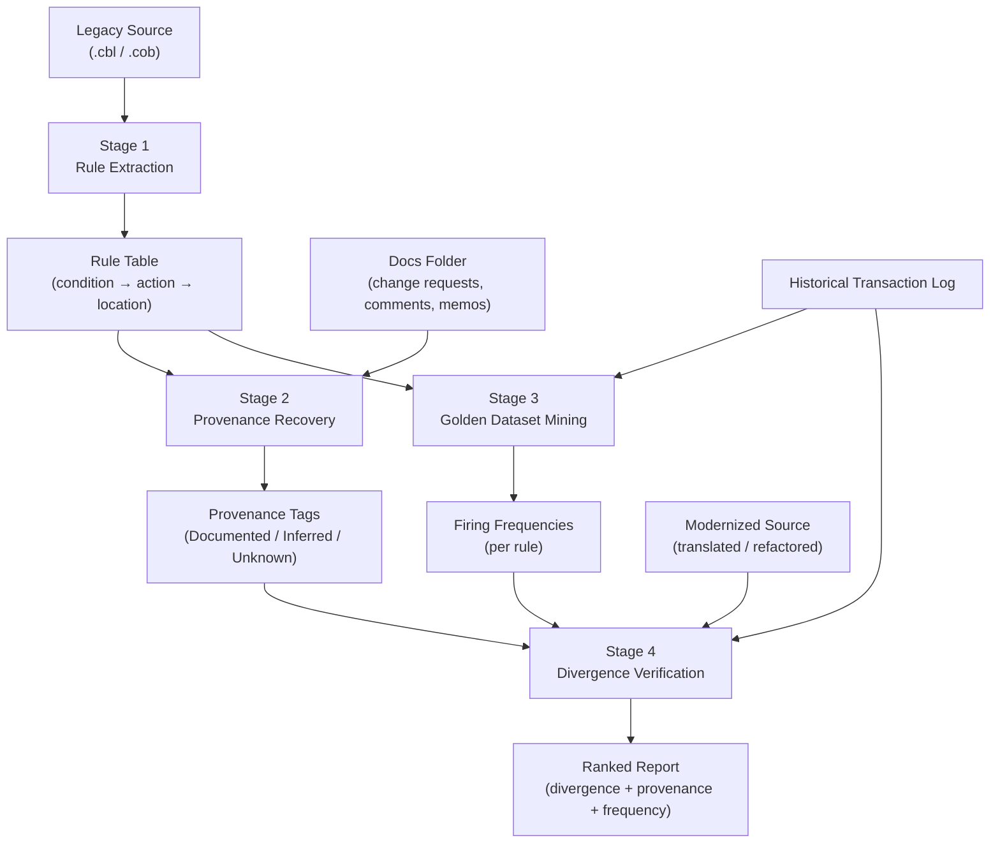

# COBOLogist

> **One-Line Pitch:** A risk-auditing tool that tells you what business rules you'll silently break when modernizing legacy code — and why anyone should care — instead of just translating code and hoping.

---

## The Problem

Legacy modernization projects — COBOL migrations being the canonical example — are almost always judged on a single criterion: does the translated code compile and pass basic tests? That bar is dangerously low.

Decades-old codebases routinely encode undocumented business logic: edge-case handling baked in after a 1987 regulatory memo, a grace-period rule added to prevent a specific fraud vector, a state-level carve-out negotiated in a contract no one can locate anymore. The engineers who wrote those rules have retired. The comments, if they exist at all, say *what* the code does, not *why* it was written that way.

Existing tooling attacks the translation problem, not the understanding problem. Compiler-upgrade advisors validate that modernized code behaves identically to legacy code on synthetic inputs. Natural-language code explainers tell you what a paragraph of COBOL does in plain English. Symbolic-execution test generators synthesize test cases that exercise branches. All of these validate that code *works* — but none of them tell you *why a rule exists*, *what real-world evidence there is that it ever mattered*, or *whether it's safe to drop it* before you translate.

---

## The Solution — How It Works

The Legacy Provenance Engine is a four-stage pipeline that answers those questions systematically.

**1. Rule Extraction**

The first stage performs deterministic static analysis on the legacy source. It parses the code into a structured rule table where each row captures a condition, the action taken when that condition is true, and the exact source location (file, line range, paragraph name). No model judgment is involved — this is pure program analysis. The output is a machine-readable manifest of every decision point in the program.

**2. Provenance Recovery**

The second stage takes the rule table and attempts to explain where each rule came from. It searches the available documentation corpus — change-request tickets, commit messages, inline comments, compliance memos — and tries to match each rule to a source of intent. Rules are tagged one of three ways: **Documented** (a written artifact clearly accounts for this rule), **Inferred** (a plausible link to documentation exists but is not explicit), or **Unknown** (no documentation evidence found). Fuzzy matching of freeform historical text is delegated to an LLM, since that is a legitimate use case where a wrong guess is reviewable and low-stakes.

**3. Golden Dataset Mining**

The third stage replays real historical transaction logs against the extracted rules to compute empirical evidence. For each rule, it counts how many times that rule fired across the available transaction history, and what the outcomes were. Rules that never fired — or that fired only in very specific circumstances — are flagged as zero-evidence or low-evidence. This stage is pure computation: counting, grouping, and frequency analysis, with no model involvement.

**4. Divergence Verification**

The fourth and final stage runs both the legacy code and the modernized code against the same historical transaction set, then diffs the outputs field by field. Any output that differs between legacy and modern versions is a divergence. Each divergence is joined to its corresponding rule's provenance tag and historical firing frequency, producing a single ranked report. The diff itself is deterministic. An LLM is used only to write the plain-English explanation of *why* a divergence is meaningful — it is never used to decide whether two outputs match.

---

**Example output:**

```
Rule #4 diverges. No documentation found. Fired 12 times in 5 years, all approved.
```

That single line is the product's core value: it does not just say a rule broke — it tells you the rule has real production history, no paper trail, and that every time it fired, something got approved that might now be rejected silently.

---

## Architecture Diagram



---

## What's Deterministic vs. What Uses an LLM

| Stage | Deterministic or LLM-assisted | Why |
|---|---|---|
| Stage 1 — Rule Extraction | Deterministic | Pure static analysis. No model judgment on safety-critical logic. The rule table must be reproducible and auditable. |
| Stage 2 — Provenance Recovery | LLM-assisted | Fuzzy matching of freeform historical text is a legitimate LLM use case. A wrong match is low-risk: a human reviewer sees the evidence and can disagree. |
| Stage 3 — Golden Dataset Mining | Deterministic | Pure computation and counting over structured log data. Frequencies are facts, not opinions. |
| Stage 4 — Divergence Verification | Deterministic for the diff; LLM-assisted only for plain-English explanation | Whether two output fields match is a binary fact determined by exact comparison. The LLM writes the human-readable summary of a divergence; it never decides whether one exists. |

Safety-critical decisions in this pipeline are deliberately kept boring and auditable. The rule table is a static artifact. Divergence detection is exact string/numeric comparison. LLM reasoning is used only in two places — provenance text matching and report narration — and in both cases the raw evidence is always surfaced alongside the model's interpretation so a human can verify or override. If the model gets provenance wrong, the worst outcome is a mislabeled tag that a reviewer catches. The diff is never delegated.

---

## Role of IBM Bob in This Project

Bob plays two distinct roles in this project.

**As development partner:** The entire pipeline was planned, built, and debugged using Bob's Plan, Agent, and Orchestrator modes. Bob was used to decompose the architecture into stages, write and refine each pipeline script, spawn subagents for isolated file-generation tasks (fixture fabrication, log generation, document drafting), and track progress through checkpoint-based session exports. The conversation history in `bob_sessions/` captures the full build sequence.

**As a pipeline component:** Bob's document-understanding capability directly powers Stage 2. When the pipeline needs to match a rule against a corpus of change-request documents, it calls Bob (via a configured skill) to perform the fuzzy semantic match and return a provenance tag with a cited excerpt. This is the only place in the pipeline where Bob's reasoning appears in the output artifact.

**Bob artifacts in this repo:**

- [`AGENTS.md`](../AGENTS.md) — agent role definitions and task assignments used during development
- [`.bob/custom_modes.yaml`](../.bob/custom_modes.yaml) — custom Bob modes configured for this project (Orchestrator, Pipeline Engineer)
- [`.bob/skills/`](../.bob/skills/) — custom skills loaded into Bob for provenance matching and report narration
- [`bob_sessions/`](../bob_sessions/) — exported session logs capturing planning and build conversations

---

## Demo Scenario

The demo fixture is a small claims-eligibility program that evaluates whether a submitted insurance claim qualifies for payment. It contains four to five rules: a standard eligibility rule, a 30-day grace-period rule for lapsed policies, a state regulatory carve-out that overrides the standard rule for specific jurisdictions, and one orphaned rule — a condition with no corresponding change-request document, no comment, and no obvious connection to any known policy — that happens to have fired a handful of times in the historical log.

The demo's climax is the modernized translation silently dropping the orphaned rule's behavior. The divergence report catches it, reports zero documentation, shows its real firing history, and forces the question: *was this intentional?* That moment is the pitch.

---

## Positioning vs. Existing Tools

| Tool | What it does | What it doesn't do |
|---|---|---|
| **IBM CUAZ** (IBM Db2 for z/OS & Compiler Upgrade Assistant) | Compiler-version upgrade guidance, inventory scanning, dependency mapping | Does not recover business rationale; does not use production evidence to assess rule importance |
| **watsonx Code Assistant for Z** | Natural-language explanation of COBOL paragraphs, translation assistance, test generation guidance | Does not tell you *why* a rule was written; does not validate against historical production behavior |
| **IBM Research Symbolic-Execution Equivalence Testing** | Generates synthetic test cases that exercise branches; proves behavioral equivalence on those cases | Synthetic inputs cannot replicate decades of real edge-case distribution; does not link rules to documentation |
| **Legacy Provenance Engine** | Mines real historical production evidence for every extracted rule; recovers documented business rationale from freeform artifact corpora; surfaces undocumented rules with real firing history before translation | — |

This tool is complementary to all of the above, not a competitor — it is a pre-flight risk layer that answers the question the others assume has already been answered.

---

## Impact / Results

*(To be filled in after the pipeline runs on the fixture.)*

- **[X]** rules extracted from the fixture program
- **[Y]%** of rules tagged Undocumented or Unknown
- **[Z]** real divergence(s) caught between legacy and modernized versions
- **[N]** of those divergences had zero documentation and non-zero firing history

---

## Repo Structure

```
legacy-provenance-engine/
├── legacy/                  # Original COBOL source (fixture)
├── modern/                  # Translated / modernized version (with injected bug)
├── history/                 # Historical transaction log (fabricated fixture data)
├── docs/
│   ├── change_requests/     # Fabricated change-request documents for provenance corpus
│   └── PROJECT_OVERVIEW.md  # This file
├── pipeline/                # Stage 1–4 scripts
├── .bob/
│   ├── custom_modes.yaml    # Custom Bob modes
│   └── skills/              # Custom Bob skills
├── bob_sessions/            # Exported Bob session logs
├── output/                  # Generated reports
└── AGENTS.md                # Agent role definitions
```

---

## Team Workplan / Status Checklist

- [ ] Fixture COBOL program written (`legacy/claims_eligibility.cbl`)
- [ ] Historical transaction log fabricated (`history/transactions.json`)
- [ ] Change-request documents fabricated (`docs/change_requests/`)
- [ ] Modernized / translated version written with injected silent bug (`modern/`)
- [ ] Stage 1 — Rule Extraction script built (`pipeline/stage1_extract.py`)
- [ ] Stage 2 — Provenance Recovery script built (`pipeline/stage2_provenance.py`)
- [ ] Stage 3 — Golden Dataset Mining script built (`pipeline/stage3_mining.py`)
- [ ] Stage 4 — Divergence Verification script built (`pipeline/stage4_divergence.py`)
- [ ] Bob custom mode + skill configured (`.bob/custom_modes.yaml`, `.bob/skills/`)
- [ ] Subagent spawn evidence captured in `bob_sessions/`
- [ ] Full pipeline run end-to-end; report generated in `output/`
- [ ] Impact / Results placeholders filled in with real numbers
- [ ] Pitch deck built
- [ ] Dry runs completed; demo flow rehearsed

## Known Limitations

**Stage 1 — Rule Extractor scope boundary**

This extractor is intentionally scoped to clean, one-paragraph-per-rule COBOL where each rule is a single IF block with no nesting, no GO TO, and no logic split across multiple paragraphs via PERFORM THRU. Real production COBOL frequently violates all of these assumptions. This extractor demonstrates the pipeline's method on a controlled fixture; generalizing it to arbitrary legacy COBOL would require a proper COBOL grammar parser (e.g. building on an existing COBOL AST library) rather than paragraph-label pattern matching. This is a known, deliberate scope boundary, not an oversight.
